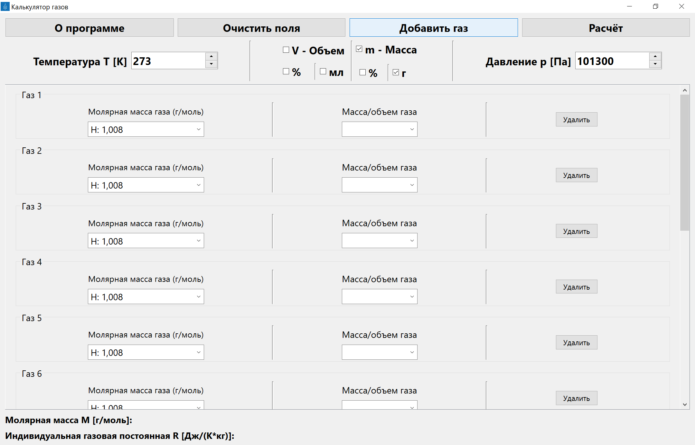
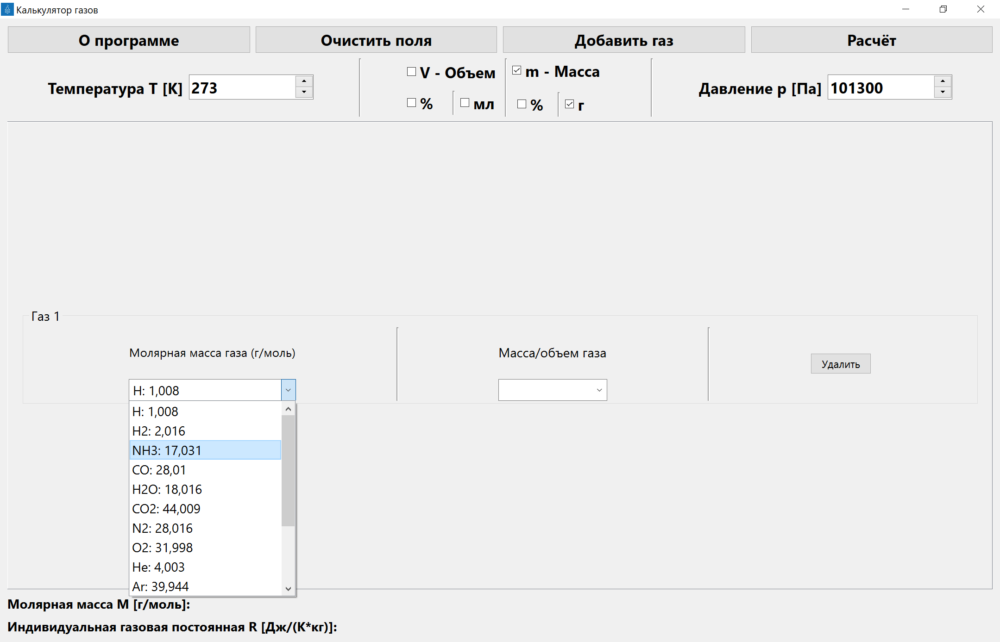
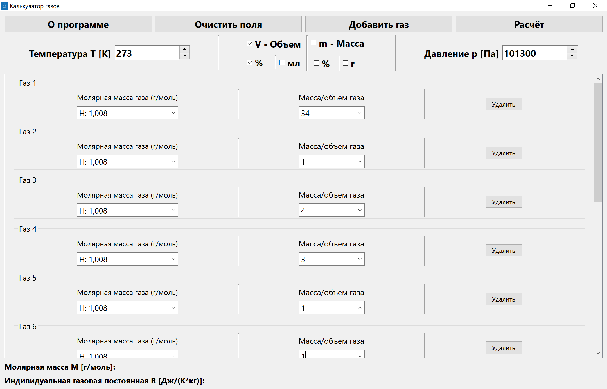
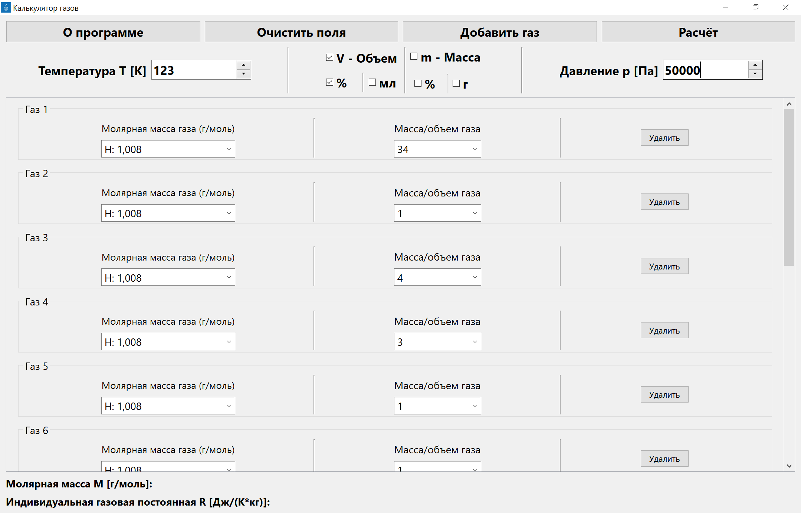
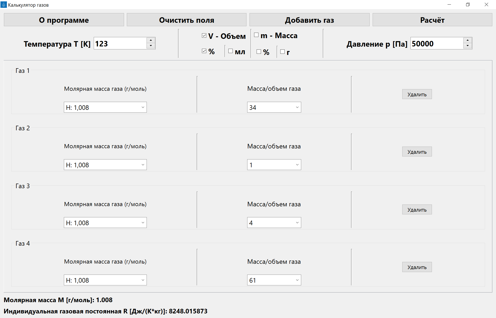

# Калькулятор для рассчета универсальной газовой постоянной и молярной массы смеси газов.

Калькулятор делает расчет для неограниченного числа газов, которые можно добавлять, нажав кнопку Добавить газ.

Калькулятор принимает на вход данные о молярной массе газа, которую можно выбрать из выпадающего меню.

Также для газов доступен ввод об их массе/объеме, ввод которых можно настроить на главном меню.

Также можно менять настройки давления и температуры среды, в которой находятся газы.

После введения всех значений следует нажать кнопку Расчёт, чтобы получить интересующие данные.

